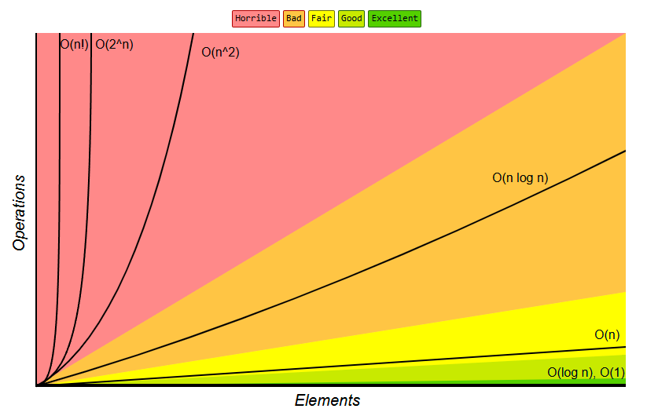
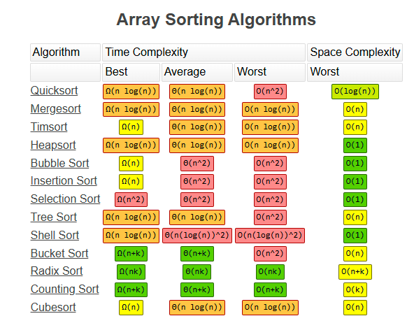

# 📘 Entendendo Big O Notation — Seu Superpoder de Otimização

## 🚀 Introdução Motivadora

Imagine que seu código é um carro numa estrada. À primeira vista, tudo parece funcionar. Mas, e se você estiver carregando milhões de dados? É como subir uma serra com o tanque quase vazio. A **Big O Notation** é o **medidor de combustível da eficiência do seu código** — ela te mostra *como* e *quanto* seu algoritmo consome à medida que o tamanho dos dados cresce.

🔍 **Por que isso importa?**  
Porque o tempo e os recursos consumidos por algoritmos crescem — muitas vezes de forma **exponencial**. Saber analisar essa complexidade é essencial para:
- Escrever código escalável
- Evitar gargalos de performance
- Tomar decisões técnicas com confiança

> ⚡ Segundo a IEEE, 60% dos gargalos em sistemas vêm da **má escolha de algoritmos**.

---
## 📊 Big O Complexity Chart


## 🧠 Explicação Técnica

### 🧮 O que é Big O?

A notação Big O descreve o **comportamento assintótico** de um algoritmo — ou seja, como ele cresce em relação ao tamanho da entrada (`n`).

Fórmula básica:
```math
O(f(n))
```
Onde `f(n)` representa o número de operações em função do tamanho da entrada `n`.

---

## ❓ Por que desconsideramos as constantes em Big O?

> Bem, o quadrado de 64 é 4096. Se você adicionar 4096 ao número 2⁶⁴, será um valor desprezível com relação aos algarismos significativos.

Essa analogia resume bem o motivo pelo qual, ao trabalharmos com Big O, focamos apenas nos **termos dominantes** da função de complexidade.

💡 **Explicando melhor**:  
Quando analisamos o crescimento de um algoritmo em relação ao tamanho da entrada (`n`), o que realmente importa é **como** esse crescimento se comporta conforme `n` aumenta — não o valor exato de cada operação. Por isso:

- Termos menores se tornam irrelevantes à medida que `n` cresce.
- Coeficientes como `100n` ou `0.5n` são ignorados, pois **não alteram a ordem de crescimento**.
- O foco é sempre no pior cenário de crescimento ao infinito.

🔎 Exemplo:
```math
f(n) = 3n^2 + 10n + 100
```
🔽 Torna-se:
```math
O(n^2)
```
Porque o termo `n²` domina todos os outros no longo prazo.

---

## 📈 Gráfico de Crescimento das Complexidades

| Notação      | Nome técnico       | Exemplos típicos                          |
|--------------|--------------------|-------------------------------------------|
| O(1)         | Constante          | Acesso direto a vetor ou hash             |
| O(log n)     | Logarítmica        | Busca binária, compressão                 |
| O(n)         | Linear             | Loop simples, verificação de elementos    |
| O(n log n)   | Quase linear       | Merge Sort, algoritmos de ordenação otimizados |
| O(n²)        | Quadrática         | Comparação de todos os pares              |
| O(2ⁿ)        | Exponencial        | Problemas de decisão (ex: subconjuntos)   |
| O(n!)        | Fatorial           | Permutações completas (ex: caixeiro viajante) |

---

## 🧠 Complexidade de Tempo vs. Espaço

Abaixo, exemplos **em C++** representando **tempo e espaço** para cada uma das 7 complexidades:

### O(1) – Constante
```cpp
// Retorna o primeiro elemento de um array — tempo de execução constante
int getFirst(int arr[]) {
    return arr[0];
}
```

### O(log n) – Logarítmica
```cpp
// Realiza busca binária em um array ordenado
bool binarySearch(int arr[], int size, int target) {
    int left = 0, right = size - 1;
    while (left <= right) {
        int mid = (left + right) / 2;
        if (arr[mid] == target) return true;
        if (arr[mid] < target) left = mid + 1;
        else right = mid - 1;
    }
    return false;
}
```

### O(n) – Linear
```cpp
// Soma todos os elementos de um array — percorre o array uma vez
int sum(int arr[], int size) {
    int total = 0;
    for (int i = 0; i < size; ++i)
        total += arr[i];
    return total;
}
```

### O(n log n) – Quase linear
```cpp
// Ordena os elementos de um array usando sort (ex: MergeSort ou QuickSort)
#include <algorithm>

void sortArray(int arr[], int size) {
    std::sort(arr, arr + size);
}
```

### O(n²) – Quadrática
```cpp
// Imprime todos os pares possíveis em um array — loop aninhado
void printPairs(int arr[], int size) {
    for (int i = 0; i < size; ++i)
        for (int j = 0; j < size; ++j)
            std::cout << arr[i] << ", " << arr[j] << std::endl;
}
```

### O(2ⁿ) – Exponencial
```cpp
// Calcula o n-ésimo número de Fibonacci recursivamente
int fibonacci(int n) {
    if (n <= 1) return n;
    return fibonacci(n - 1) + fibonacci(n - 2);
}
```

### O(n!) – Fatorial
```cpp
// Gera todas as permutações possíveis de uma string (ex: rota de entregas)
void permute(std::string s, int l, int r) {
    if (l == r)
        std::cout << s << std::endl;
    else {
        for (int i = l; i <= r; i++) {
            std::swap(s[l], s[i]);
            permute(s, l + 1, r);
            std::swap(s[l], s[i]);
        }
    }
}
```

---

## 🗃️ Common Data Structure Operations


## 🔢 Array Sorting Algorithms



## 🚀 Get the Official Big-O Cheat Sheet Poster


## 🔬 Casos Práticos para Cada Complexidade

### 🧊 O(1) – Verificar se um número é par
```cpp
bool isEven(int x) {
    return x % 2 == 0;
}
```
🔍 *Aplicação:* Otimização de checks simples em validações financeiras.

---

### 🔁 O(log n) – Busca binária em base de dados indexada
```cpp
bool binarySearch(int arr[], int size, int target) {
    int left = 0, right = size - 1;
    while (left <= right) {
        int mid = (left + right) / 2;
        if (arr[mid] == target) return true;
        if (arr[mid] < target) left = mid + 1;
        else right = mid - 1;
    }
    return false;
}
```
🔍 *Aplicação:* Consultas rápidas em bases indexadas (ex: buscas em árvores B).

---

### 📊 O(n) – Processar transações de um extrato
```cpp
int sumTransactions(int transactions[], int size) {
    int total = 0;
    for (int i = 0; i < size; ++i) {
        total += transactions[i];
    }
    return total;
}
```
🔍 *Aplicação:* Somar valores diários em um relatório contábil.

---

### 🔃 O(n log n) – Ordenar clientes por faturamento
```cpp
#include <algorithm>

void sortRevenue(int revenue[], int size) {
    std::sort(revenue, revenue + size);
}
```
🔍 *Aplicação:* Dashboards financeiros que precisam de ordenação eficiente.

---

### 🔗 O(n²) – Comparar similaridade entre produtos
```cpp
void compareProducts(int features[], int size) {
    for (int i = 0; i < size; ++i) {
        for (int j = 0; j < size; ++j) {
            if (i != j && features[i] == features[j]) {
                std::cout << "Produto " << i << " é semelhante ao produto " << j << std::endl;
            }
        }
    }
}
```
🔍 *Aplicação:* Algoritmos de recomendação (comparando descrições de produtos entre si).

---

### 🧬 O(2ⁿ) – Subconjuntos possíveis de uma carteira de investimentos
```cpp
#include <vector>
#include <iostream>

void generateSubsets(std::vector<int>& portfolio, std::vector<int>& current, int index) {
    if (index == portfolio.size()) {
        std::cout << "{ ";
        for (int asset : current) std::cout << asset << " ";
        std::cout << "}\n";
        return;
    }
    generateSubsets(portfolio, current, index + 1);
    current.push_back(portfolio[index]);
    generateSubsets(portfolio, current, index + 1);
    current.pop_back();
}
```
🔍 *Aplicação:* Simulações de risco com portfólios em decisões financeiras complexas.

---

### 🧭 O(n!) – Planejamento logístico com permutação de rotas
```cpp
#include <iostream>
#include <string>
#include <algorithm>

void permuteRoutes(std::string route, int l, int r) {
    if (l == r) {
        std::cout << route << std::endl;
    } else {
        for (int i = l; i <= r; i++) {
            std::swap(route[l], route[i]);
            permuteRoutes(route, l + 1, r);
            std::swap(route[l], route[i]);
        }
    }
}
```
🔍 *Aplicação:* Algoritmo de caixeiro viajante usado em planejamento de entrega de mercadorias.

---

## 📚 Referências e Leitura Recomendada

1. 📘 [FreeCodeCamp - O que é Big O?](https://www.freecodecamp.org/portuguese/news/o-que-e-a-notacao-big-o-complexidade-de-tempo-e-de-espaco/)  
2. 🧠 [Khan Academy - Notação Assintótica](https://pt.khanacademy.org/computing/computer-science/algorithms/asymptotic-notation/a/big-o-notation)  
3. 🛠 [Medium - Big O na Prática](https://medium.com/linkapi-solutions/o-que-%C3%A9-big-o-notation-32f171e4a045)
4. 🙏 [Eric Rowell](https://www.bigocheatsheet.com/)

---
